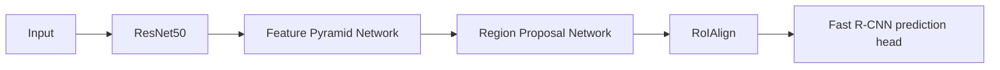
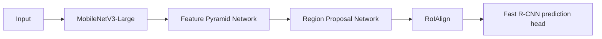
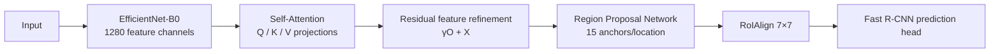
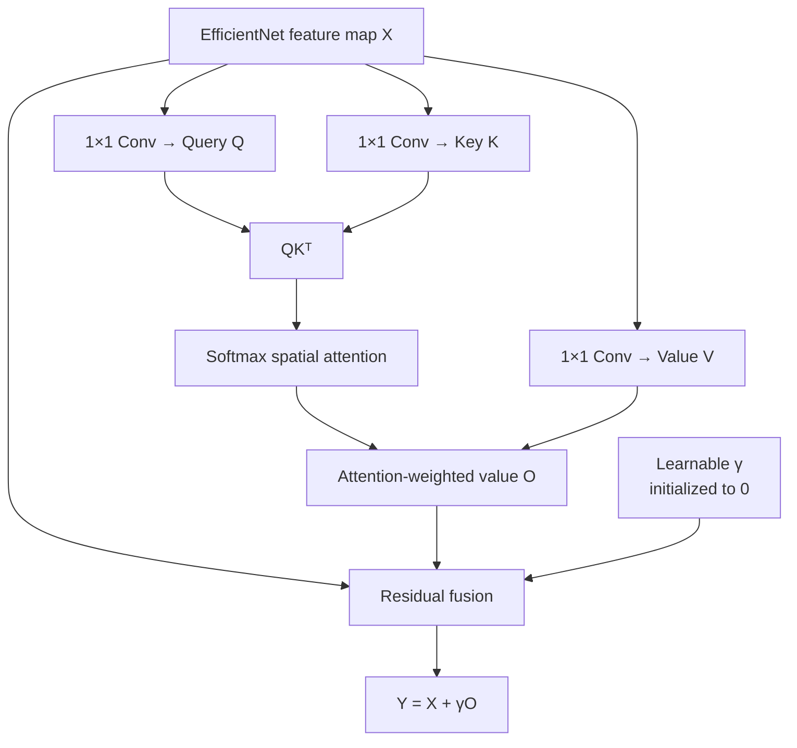
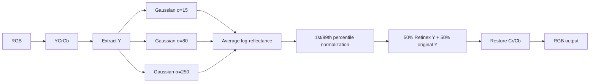
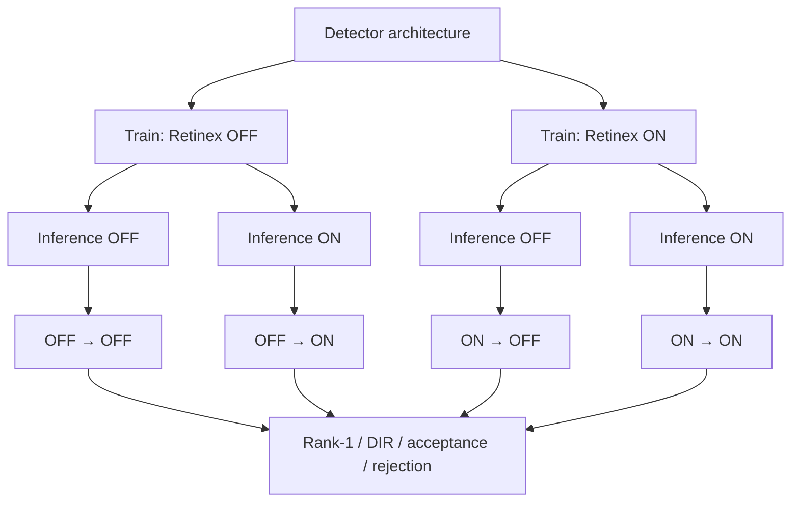

# Face Detection and Identity Recognition with EfficientNet-B0, Self-Attention, MSR-Y Retinex, and FaceNet

  
  
  
  
  

## Overview

This repository presents a complete experimental machine-learning pipeline for **face detection and identity recognition**. The study compares three Faster R-CNN detector configurations under controlled preprocessing conditions:

- **ResNet50-FPN Faster R-CNN**
- **MobileNetV3-Large-FPN Faster R-CNN**
- **EfficientNet-B0 + Self-Attention Faster R-CNN**

Each detector is trained and evaluated in two matched preprocessing regimes:

- **Retinex OFF**
- **MSR-Y Retinex ON**

Face identity is evaluated in a separate embedding stage using a frozen **FaceNet / InceptionResnetV1 model pretrained on VGGFace2**. Detected face regions are converted into **512-dimensional L2-normalized embeddings** and matched against train-only reference centroids.

The notebook therefore evaluates not only detector accuracy, but also:

- the effect of Retinex on each architecture;
- train/inference preprocessing consistency;
- downstream embedding-based identity recognition;
- robustness under controlled lighting perturbations;
- detector and end-to-end latency;
- GPU memory usage;
- reproducibility through deterministic initialization and checkpointing.

The complete experiment is implemented in:

> **`face_identity_full.ipynb`**

---

## Table of Contents

1. [Research Objective](#research-objective)
2. [Dataset Configuration](#dataset-configuration)
3. [System Architecture](#system-architecture)
4. [Detector Architectures](#detector-architectures)
5. [Self-Attention Module](#self-attention-module)
6. [MSR-Y Retinex Preprocessing](#msr-y-retinex-preprocessing)
7. [FaceNet Identity Recognition](#facenet-identity-recognition)
8. [Experimental Protocol](#experimental-protocol)
9. [Main Results](#main-results)
10. [Retinex Ablation](#retinex-ablation)
11. [Identity Recognition Results](#identity-recognition-results)
12. [Lighting Robustness](#lighting-robustness)
13. [Computational Performance](#computational-performance)
14. [Reproducibility](#reproducibility)
15. [Notebook Coverage](#notebook-coverage)
16. [Methodological Interpretation](#methodological-interpretation)
17. [Limitations](#limitations)
18. [References](#references)

---

# Research Objective

The objective of this work is to evaluate whether a detector based on **EfficientNet-B0 enhanced with a spatial Self-Attention block** can provide a stronger accuracy–robustness profile than conventional ResNet50-FPN and MobileNetV3-FPN baselines, and to determine how **MSR-Y Retinex illumination normalization** affects the three architectures.

The proposed experimental pipeline is:

**illumination preprocessing → face detection → face crop extraction → FaceNet embedding → prototype matching → thresholded identity decision**

The methodological contribution is not the invention of EfficientNet, Faster R-CNN, Retinex, or FaceNet individually. Instead, the project provides a controlled implementation and evaluation of their integration, with particular emphasis on:

1. **EfficientNet-B0 + Self-Attention as a Faster R-CNN feature extractor**;
2. **controlled Retinex OFF/ON ablation** for every detector;
3. **full 2×2 train/inference Retinex consistency analysis**;
4. **independent embedding-based identity recognition** using FaceNet;
5. **latency, memory, and lighting-robustness analysis** under the same experimental pipeline.

---

# Dataset Configuration

For the repository-level experimental configuration, a curated subset of **VGGFace2** is organized into training, validation, and test partitions.

| Split | Face images | Records / profiles | Share |
|---|---:|---:|---:|
| Train | 3,039 | 3,039 | 33.7% |
| Validation | 2,941 | 2,941 | 32.6% |
| Test | 3,036 | 3,036 | 33.7% |
| **Total** | **9,016** | **9,016** | **100%** |

The partitions serve distinct experimental purposes:

- **Train** — parameter optimization and construction of reference embeddings;
- **Validation** — intermediate evaluation and identity-distance threshold calibration;
- **Test** — final evaluation after the model and decision rules are fixed.

> **Reproducibility note.** The dataset split above follows the project-level release specification. Numerical performance tables in this README reproduce the executed outputs stored in `face_identity_full.ipynb`.

---

# System Architecture

```mermaid
flowchart LR
    A["RGB input image"] --> B{"MSR-Y Retinex"}
    B -->|OFF| C["Original RGB"]
    B -->|ON| D["Illumination-normalized RGB"]

    C --> E["Face detector"]
    D --> E

    E --> F["Predicted face bounding box"]
    F --> G["Face crop + resize to 160×160"]
    G --> H["FaceNet / InceptionResnetV1<br/>VGGFace2 pretrained"]
    H --> I["512D L2-normalized embedding"]
    I --> J["Train-only centroid gallery"]
    J --> K["Embedding distance"]
    K --> L["Nearest identity prototype"]
    L --> M["Validation-calibrated threshold"]
    M --> N["Final identity decision"]
```

The pipeline is intentionally separated into two stages:

### Detection stage
A Faster R-CNN detector localizes the face region.

### Identity stage
A frozen FaceNet model transforms the detected region into a 512D feature vector and performs nearest-prototype matching.

FaceNet is **not jointly optimized with the detector**, and its embedding loss is not added to the Faster R-CNN objective.

---

# Detector Architectures

## 1. ResNet50-FPN Faster R-CNN

The ResNet50 configuration follows the standard two-stage Faster R-CNN design with FPN-based multi-scale features.

**Recorded parameter count:** 41.31 million.

---

## 2. MobileNetV3-Large-FPN Faster R-CNN

MobileNetV3-Large-FPN serves as the computationally lightweight baseline.

**Recorded parameter count:** 18.94 million.

The model provides the lowest inference latency and GPU memory usage among the evaluated architectures.

---

## 3. EfficientNet-B0 + Self-Attention Faster R-CNN

The primary modified architecture uses:

- **EfficientNet-B0** as the feature extractor;
- **1280-channel output representation**;
- a custom spatial **Self-Attention** block;
- Faster R-CNN RPN and RoI processing;
- anchor sizes `32, 64, 128, 256, 512`;
- aspect ratios `0.5, 1.0, 2.0`;
- **15 anchors per spatial location**;
- RoIAlign output size `7×7`;
- sampling ratio `2`.

**Recorded parameter count:** 87.47 million.

---

# Self-Attention Module

The attention block receives an EfficientNet feature tensor

$$
X \in \mathbb{R}^{B \times C \times H \times W}.
$$

Three learnable projections are constructed:

$$
Q = W_qX,\qquad
K = W_kX,\qquad
V = W_vX.
$$

The spatial attention matrix is:

$$
A = \operatorname{softmax}(QK^T),
$$

and the attended representation is merged through a residual formulation:

$$
Y = X + \gamma O.
$$

Here, $\gamma$ is a learnable scalar initialized to zero.

This design is important because the attention module initially behaves approximately as an identity mapping. During optimization, the network can progressively learn the contribution of global spatial dependencies without abruptly replacing the EfficientNet representation at initialization.

---

# MSR-Y Retinex Preprocessing

The project uses a fixed **Multi-Scale Retinex on luminance (MSR-Y)** preprocessing algorithm.

It is:

- not MSRCR;
- not a trainable neural Retinex model;
- not conditionally activated by an image-brightness threshold.

The RGB image is converted to **YCrCb**, and Retinex is applied only to the luminance channel $Y$. Chromatic channels $Cr$ and $Cb$ are preserved.

The multi-scale reflectance estimate is:

$$
R(x,y)
=
\frac{1}{3}
\sum_{k=1}^{3}
\left[
\log(Y(x,y)+1)
-
\log(G_{\sigma_k} * (Y(x,y)+1))
\right].
$$

### Retinex configuration

| Parameter | Configuration |
|---|---|
| Method | MSR-Y |
| Color space | RGB → YCrCb |
| Processed component | Y luminance |
| Illumination-map maximum side | 256 px |
| Gaussian scales | 15, 80, 250 |
| Scale weights | 1/3 each |
| Normalization | 1st / 99th percentiles |
| Luminance blending | 50% original + 50% Retinex |
| Cr/Cb channels | Preserved |
| Brightness activation threshold | None |

The role of Retinex is evaluated experimentally rather than assumed to be beneficial.

---

# FaceNet Identity Recognition

Identity recognition is performed using:

**`InceptionResnetV1(pretrained="vggface2")`**

The network is evaluated in frozen mode.

For each detected face:

1. the face crop is extracted;
2. the crop is resized to **160×160**;
3. input normalization is applied;
4. FaceNet produces a **512D embedding**;
5. the embedding is L2-normalized.

For reference samples belonging to the same identity, the train embeddings are averaged and normalized again to form a centroid:

$$
g_i =
\frac{
\frac{1}{N_i}\sum_{j=1}^{N_i}e_{ij}
}{
\left\|
\frac{1}{N_i}\sum_{j=1}^{N_i}e_{ij}
\right\|_2
}.
$$

A query embedding $q$ is compared against gallery centroid $g_i$ using:

$$
d(q,g_i)
=
\sqrt{\max(2 - 2g_i^Tq, 0)}.
$$

For L2-normalized embeddings, this distance is monotonically related to cosine similarity.

Two independent galleries are constructed:

- gallery for **Retinex OFF**;
- gallery for **Retinex ON**.

This keeps query and reference preprocessing domains aligned.

---

# Experimental Protocol

## Training configuration

| Parameter | Value |
|---|---:|
| Epochs | 15 |
| Batch size | 2 |
| Optimizer | SGD |
| Learning rate | 0.005 |
| Momentum | 0.9 |
| Weight decay | 0.0005 |
| Precision | FP32 |
| Random seed | 20260915 |
| Scheduler | None |
| Early stopping | None |
| Gradient accumulation | None |

Each architecture is trained twice:

1. **without Retinex**;
2. **with Retinex**.

This produces **six complete detector training runs**.

Within each architecture pair, the OFF and ON models are recreated from the same random seed, and the notebook explicitly verifies equality of the initial-state SHA-256 hashes.

---

## Retinex train/inference ablation

After training, identity recognition is evaluated in the full 2×2 preprocessing design:

| Training | Inference |
|---|---|
| OFF | OFF |
| OFF | ON |
| ON | OFF |
| ON | ON |

The distance threshold is calibrated using **validation queries only**. Test data are not used to choose the threshold.

---

# Main Results

## Detection quality on the test set

Best values for each metric are shown in **bold**.

| Model | Retinex | AP ↑ | AP75 ↑ | Precision ↑ | Recall ↑ | F1 ↑ |
|---|:---:|---:|---:|---:|---:|---:|
| ResNet50-FPN | OFF | **0.861** | 0.978 | 0.578 | **1.000** | 0.732 |
| ResNet50-FPN | ON | 0.830 | 0.929 | 0.627 | **1.000** | 0.771 |
| MobileNetV3-FPN | OFF | 0.823 | 0.984 | 0.687 | **1.000** | 0.814 |
| MobileNetV3-FPN | ON | 0.791 | 0.901 | 0.780 | **1.000** | 0.877 |
| EfficientNet-B0 + Self-Attention | OFF | 0.822 | 0.959 | 0.884 | **1.000** | 0.938 |
| EfficientNet-B0 + Self-Attention | ON | 0.843 | **1.000** | **0.899** | **1.000** | **0.947** |

### Interpretation

The results show two complementary findings:

- **ResNet50-FPN without Retinex** achieves the highest overall AP: **0.861**.
- **EfficientNet-B0 + Self-Attention with Retinex** achieves the best:
  - **AP75 = 1.000**
  - **Precision = 0.899**
  - **F1 = 0.947**

Therefore, EfficientNet-B0 + Self-Attention + Retinex provides the strongest **balanced detection quality**, while ResNet50 retains the absolute maximum AP.

---

# Retinex Ablation

The most informative Retinex comparison is performed **within the same architecture**, because the detector heads are not completely identical across all three models.

| Architecture | AP OFF | AP ON | ΔAP | F1 OFF | F1 ON | ΔF1 |
|---|---:|---:|---:|---:|---:|---:|
| ResNet50-FPN | **0.861** | 0.830 | −0.031 | 0.732 | 0.771 | +0.039 |
| MobileNetV3-FPN | 0.823 | 0.791 | −0.032 | 0.814 | 0.877 | **+0.062** |
| EfficientNet-B0 + Self-Attention | 0.822 | **0.843** | **+0.021** | **0.938** | **0.947** | +0.008 |

The key result is that **EfficientNet-B0 + Self-Attention is the only evaluated architecture whose AP improves after enabling Retinex**:

$$
0.822 \rightarrow 0.843
$$

corresponding to:

$$
\Delta AP = \mathbf{+0.021}.
$$

By contrast:

- ResNet50: $\Delta AP=-0.031$
- MobileNetV3: $\Delta AP=-0.032$

Retinex therefore exhibits an **architecture-dependent effect** rather than a universal improvement.

---

# Identity Recognition Results

Identity evaluation includes detector success, localization, FaceNet embedding matching, and the calibrated distance threshold.

## Matched preprocessing regimes

Best values are shown in **bold**. Equal maxima are jointly highlighted.

| Model | Rank-1 OFF→OFF ↑ | DIR OFF→OFF ↑ | Rank-1 ON→ON ↑ | DIR ON→ON ↑ |
|---|---:|---:|---:|---:|
| ResNet50-FPN | **1.000** | **1.000** | **1.000** | **1.000** |
| MobileNetV3-FPN | **1.000** | 0.994 | 0.981 | 0.981 |
| EfficientNet-B0 + Self-Attention | **1.000** | **1.000** | **1.000** | **1.000** |

EfficientNet-B0 + Self-Attention maintains maximum Rank-1 and DIR in both matched preprocessing regimes.

---

## Full 2×2 identity evaluation for EfficientNet-B0 + Self-Attention

| Train → Inference | Rank-1 ↑ | DIR ↑ | Wrong acceptance ↓ | Rejection ↓ |
|---|---:|---:|---:|---:|
| OFF → OFF | **1.000** | **1.000** | **0.000** | **0.000** |
| OFF → ON | **1.000** | **1.000** | **0.000** | **0.000** |
| ON → OFF | **1.000** | **1.000** | **0.000** | **0.000** |
| ON → ON | **1.000** | **1.000** | **0.000** | **0.000** |

Within the executed notebook protocol, the EfficientNet-B0 + Self-Attention detector does not show identity degradation under any of the four Retinex train/inference combinations.

---

# Lighting Robustness

The notebook evaluates identity robustness under four conditions:

1. original image;
2. brightness multiplied by 0.5;
3. gamma transformation with $\gamma=1.6$;
4. one-sided synthetic shadow.

The reference gallery and identity threshold remain fixed.

| Model | Retinex | Original DIR ↑ | Brightness ×0.5 ↑ | Gamma 1.6 ↑ | Side shadow ↑ |
|---|:---:|---:|---:|---:|---:|
| ResNet50-FPN | OFF | **1.000** | **1.000** | **1.000** | **1.000** |
| ResNet50-FPN | ON | **1.000** | **1.000** | **1.000** | **1.000** |
| MobileNetV3-FPN | OFF | 0.994 | 0.994 | 0.994 | **1.000** |
| MobileNetV3-FPN | ON | 0.981 | **1.000** | **1.000** | **1.000** |
| EfficientNet-B0 + Self-Attention | OFF | **1.000** | **1.000** | **1.000** | **1.000** |
| EfficientNet-B0 + Self-Attention | ON | **1.000** | **1.000** | **1.000** | **1.000** |

EfficientNet-B0 + Self-Attention preserves **DIR = 1.000** under every evaluated lighting condition, both with and without Retinex.

---

# Computational Performance

## Detector-level efficiency

For latency, memory, and training time, lower is better.

| Model | Retinex | Detector median ↓ | Read + Detect median ↓ | Peak CUDA memory ↓ | Training time ↓ |
|---|:---:|---:|---:|---:|---:|
| ResNet50-FPN | OFF | 49.48 ms | 52.15 ms | 683.60 MiB | 19.92 min |
| ResNet50-FPN | ON | 52.34 ms | 81.03 ms | 689.26 MiB | 22.47 min |
| MobileNetV3-FPN | OFF | **13.05 ms** | **15.27 ms** | **386.93 MiB** | **5.02 min** |
| MobileNetV3-FPN | ON | 14.00 ms | 40.97 ms | **386.93 MiB** | 8.30 min |
| EfficientNet-B0 + Self-Attention | OFF | 28.46 ms | 30.91 ms | 727.12 MiB | 16.67 min |
| EfficientNet-B0 + Self-Attention | ON | 31.85 ms | 60.74 ms | 727.12 MiB | 19.59 min |

MobileNetV3 is the clear efficiency leader.

EfficientNet-B0 + Self-Attention instead represents a **quality-oriented operating point**: substantially stronger Precision/F1 than the baselines, with moderate inference latency.

---

## Full identity pipeline latency

This benchmark includes:

**image read → optional Retinex → detector → face crop → FaceNet → gallery matching**

| Model | Retinex | Median identity latency ↓ | P95 latency ↓ | Throughput ↑ |
|---|:---:|---:|---:|---:|
| ResNet50-FPN | OFF | 64.48 ms | 76.23 ms | 15.12 FPS |
| ResNet50-FPN | ON | 90.84 ms | 99.30 ms | 10.83 FPS |
| MobileNetV3-FPN | OFF | **27.49 ms** | **30.55 ms** | **35.90 FPS** |
| MobileNetV3-FPN | ON | 53.34 ms | 62.78 ms | 18.36 FPS |
| EfficientNet-B0 + Self-Attention | OFF | 42.79 ms | 50.85 ms | 22.76 FPS |
| EfficientNet-B0 + Self-Attention | ON | 74.99 ms | 90.61 ms | 13.08 FPS |

The results also quantify the computational cost of Retinex: the preprocessing step adds a substantial CPU-side latency component.

---

# Reproducibility

The notebook includes explicit reproducibility controls.

## Fixed experiment configuration

- seed: `20260915`
- FP32 training and inference;
- fixed SGD hyperparameters;
- fixed epoch count;
- no scheduler;
- no early stopping;
- no gradient accumulation.

## Matched initialization

For each detector architecture, the Retinex OFF and ON runs are recreated from the same seed.

The notebook computes and verifies the **SHA-256 hash of the initial model state**, ensuring that paired comparisons begin from equivalent initialization.

## Checkpoint contents

Each checkpoint stores:

- model state;
- optimizer state;
- epoch index;
- training history;
- Python RNG state;
- NumPy RNG state;
- PyTorch RNG state;
- CUDA RNG state.

## Reference execution environment

The executed notebook reports:

- **PyTorch:** `2.7.1+cu128`
- **CUDA:** enabled
- **Reference GPU:** NVIDIA GeForce RTX 5070 Laptop GPU
- **Precision:** FP32

The notebook explicitly requires CUDA and does not silently fall back to CPU.

---

# Notebook Coverage

`face_identity_full.ipynb` contains:

- **35 total cells**
- **23 code cells**
- **12 Markdown cells**

The executed workflow covers:

1. environment configuration;
2. data preparation;
3. Retinex implementation;
4. dataset and DataLoader construction;
5. detector architecture definitions;
6. EfficientNet-B0 + Self-Attention integration;
7. FaceNet embedding extraction;
8. train-only gallery construction;
9. CUDA architecture verification;
10. detector training;
11. checkpointing and resume support;
12. validation logging;
13. test prediction;
14. COCO-style AP evaluation;
15. latency benchmarking;
16. GPU memory measurement;
17. Retinex OFF/ON comparison;
18. 2×2 train/inference preprocessing analysis;
19. validation-only threshold calibration;
20. identity Rank-1 and DIR evaluation;
21. synthetic lighting stress testing;
22. scientific tables and figures;
23. final completion metadata.

The completed notebook contains:

- **6 detector training runs**
- **12 identity train/inference combinations**
- **24 lighting-condition result combinations**

---

# Methodological Interpretation

## Why EfficientNet-B0 + Self-Attention is the primary configuration

The selected architecture provides the strongest combined quality profile.

Without Retinex, it already reaches:

- Precision = `0.884`
- F1 = `0.938`

With Retinex:

- **Precision = 0.899**
- **F1 = 0.947**
- **AP75 = 1.000**
- AP = `0.843`

This shows that its performance is not explained solely by illumination normalization.

---

## Why the Retinex result is important

Retinex does not improve every model in the same way.

Only EfficientNet-B0 + Self-Attention shows a positive AP change:

$$
\mathbf{\Delta AP=+0.021}.
$$

The result supports an architecture-specific interpretation:

> illumination normalization can be beneficial when the resulting representation interacts effectively with the downstream feature extractor and spatial attention mechanism.

This conclusion is stronger than claiming that Retinex universally improves face detection.

---

## Accuracy versus computational cost

No single model dominates every criterion:

- **ResNet50-FPN OFF** — highest AP;
- **MobileNetV3-FPN OFF** — fastest and lowest-memory configuration;
- **EfficientNet-B0 + Self-Attention + Retinex** — strongest Precision, F1, and AP75 profile.

The project therefore evaluates the system as an **accuracy–robustness–efficiency trade-off**, rather than selecting a model from one metric alone.

---

# Limitations

The notebook explicitly supports a cautious interpretation of the results.

- Experiments use one fixed random seed.
- Part of the face localization annotation process is automatic.
- Synthetic lighting perturbations are not equivalent to independent real-world acquisition sessions.
- The validation-calibrated identity threshold should not be interpreted as a guaranteed production open-set FAR.
- FaceNet is used with pretrained VGGFace2 weights and is not fine-tuned in this experiment.
- Detector-head objectives are not completely identical across all architectures; therefore, cross-model differences cannot be attributed solely to the backbone or Self-Attention.
- The cleanest controlled Retinex comparison is the **within-architecture OFF vs ON comparison**.
- Perfect or near-perfect identity scores in the executed protocol should be interpreted as performance under the evaluated experimental conditions, not as a universal guarantee of real-world face-recognition accuracy.

---

# Key Findings

| Finding | Result |
|---|---:|
| Highest AP | **0.861 — ResNet50-FPN, Retinex OFF** |
| Highest AP75 | **1.000 — EfficientNet-B0 + Self-Attention, Retinex ON** |
| Highest Precision | **0.899 — EfficientNet-B0 + Self-Attention, Retinex ON** |
| Highest F1 | **0.947 — EfficientNet-B0 + Self-Attention, Retinex ON** |
| Positive AP change from Retinex | **+0.021 — EfficientNet-B0 + Self-Attention** |
| Best matched Rank-1 | **1.000** |
| Best matched DIR | **1.000** |
| Fastest detector | **13.05 ms — MobileNetV3-FPN, Retinex OFF** |
| Fastest full identity pipeline | **27.49 ms — MobileNetV3-FPN, Retinex OFF** |
| Lowest peak CUDA memory | **386.93 MiB — MobileNetV3-FPN** |

---

# Conclusion

This project implements a complete and reproducible experimental framework for **face detection and embedding-based identity recognition**.

The principal quality-oriented configuration is:

> **MSR-Y Retinex → EfficientNet-B0 → Self-Attention → Faster R-CNN → FaceNet/VGGFace2 512D embedding → centroid matching**

The executed experiments demonstrate that **EfficientNet-B0 + Self-Attention with Retinex** provides the strongest balanced detection profile among the evaluated configurations, with:

- **Precision = 0.899**
- **F1 = 0.947**
- **AP75 = 1.000**
- AP = `0.843`
- **ΔAP = +0.021** after enabling Retinex
- **Rank-1 = 1.000**
- **DIR = 1.000**

At the same time, the results show that Retinex is not universally beneficial: its effect is architecture-dependent, and its use introduces measurable computational overhead.

The notebook therefore supports a scientifically defensible conclusion: the strongest result emerges from the **interaction of EfficientNet-B0 feature extraction, spatial Self-Attention, controlled MSR-Y illumination normalization, and a separate FaceNet embedding-identification stage**, rather than from any individual component in isolation.

---

# References

1. Schroff, F., Kalenichenko, D., & Philbin, J. **FaceNet: A Unified Embedding for Face Recognition and Clustering.** CVPR, 2015.  
   https://arxiv.org/abs/1503.03832

2. Cao, Q., Shen, L., Xie, W., Parkhi, O. M., & Zisserman, A. **VGGFace2: A Dataset for Recognising Faces across Pose and Age.** FG, 2018.  
   https://arxiv.org/abs/1710.08092

3. Tan, M., & Le, Q. V. **EfficientNet: Rethinking Model Scaling for Convolutional Neural Networks.** ICML, 2019.  
   https://arxiv.org/abs/1905.11946

4. Ren, S., He, K., Girshick, R., & Sun, J. **Faster R-CNN: Towards Real-Time Object Detection with Region Proposal Networks.** NeurIPS, 2015.  
   https://arxiv.org/abs/1506.01497

5. Jobson, D. J., Rahman, Z., & Woodell, G. A. **A Multiscale Retinex for Bridging the Gap Between Color Images and the Human Observation of Scenes.** IEEE Transactions on Image Processing, 1997.

---

## Primary Artifact

**Jupyter Notebook:** `face_identity_full.ipynb`

The notebook contains the complete ML implementation, training logic, Retinex experiments, FaceNet identity evaluation, scientific tables, plots, latency measurements, and final experiment outputs described above.
