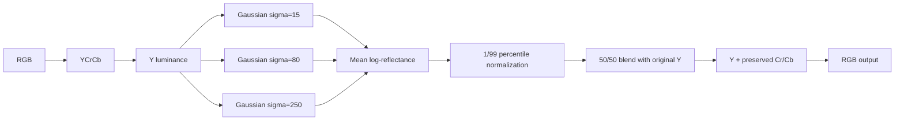
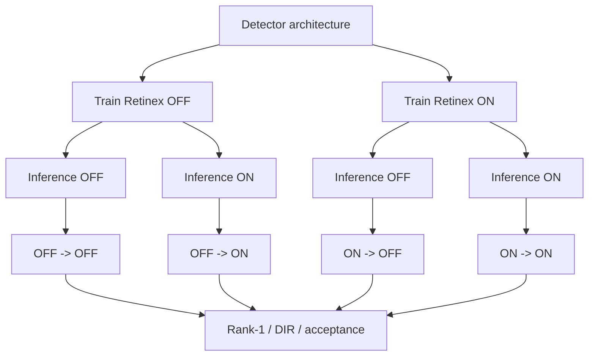

# Face Identity Recognition with EfficientNet-B0 + Self-Attention, MSR-Y Retinex and FaceNet Embeddings

## Аннотация

Проект реализует полный экспериментальный pipeline для **детекции и идентификации лиц** с сопоставлением трёх архитектур детектора — **ResNet50-FPN**, **MobileNetV3-Large-FPN** и модифицированной конфигурации **EfficientNet-B0 + Self-Attention Faster R-CNN** — в двух режимах предварительной обработки: **без Retinex** и **с MSR-Y Retinex**.

Идентификация выполняется отдельным embedding-уровнем на основе **FaceNet / InceptionResnetV1 с предобучением на VGGFace2**. Детектор локализует лицо, FaceNet преобразует найденную область в **512-мерный L2-нормированный вектор**, после чего запрос сопоставляется с эталонной train-only gallery по евклидову расстоянию.

Эксперимент включает:

- **3 архитектуры детектора**;
- **2 режима Retinex** для каждой архитектуры;
- **6 полных обучающих запусков** по 15 эпох;
- полный план идентификации **2×2**: `OFF→OFF`, `OFF→ON`, `ON→OFF`, `ON→ON`;
- проверку устойчивости к изменению освещения;
- измерение качества локализации, идентификации, задержки и GPU-памяти;
- сохранение checkpoint-состояний, истории обучения, метрик и воспроизводимого протокола.

Основной результат проекта: **EfficientNet-B0 + Self-Attention + Retinex** показал наиболее сильное сбалансированное качество детекции — `Precision = 0.899`, `F1 = 0.947`, `AP75 = 1.000` и `AP = 0.843`. При этом EfficientNet-B0 + Self-Attention является единственной из исследованных архитектур, для которой включение Retinex повысило AP: **0.822 → 0.843 (+0.021)**.

---

## 1. Исходные данные

Для экспериментального обучения использовалась сформированная подвыборка **VGGFace2**. В рабочую выборку вошло **9 016 изображений лиц**, распределённых между обучающей, валидационной и тестовой частями.

| Раздел | Количество фотографий | Количество записей/профилей | Доля |
|---|---:|---:|---:|
| Train | 3 039 | 3 039 | 33.7% |
| Validation | 2 941 | 2 941 | 32.6% |
| Test | 3 036 | 3 036 | 33.7% |
| **Всего** | **9 016** | **9 016** | **100%** |

Обучающая часть используется для оптимизации параметров моделей, validation — для контроля качества и калибровки порога идентификации, test — для итоговой оценки уже зафиксированного pipeline.

> Численные таблицы результатов ниже воспроизводят значения, сохранённые непосредственно в Jupyter Notebook; разбиение данных в этом README приведено в соответствии с проектной спецификацией репозитория.

---

## 2. Полный ML-pipeline


Pipeline разделён на два функциональных уровня:

1. **локализация лица** — Faster R-CNN с одним из трёх backbone-вариантов;
2. **идентификация** — frozen FaceNet/VGGFace2 и сопоставление 512D embeddings.

FaceNet не дообучается совместно с детектором и не включается в Faster R-CNN loss.

---

## 3. Исследуемые архитектуры

```mermaid
flowchart TB
  subgraph R["ResNet50-FPN Faster R-CNN"]
    R1["Input"] --> R2["ResNet50"] --> R3["FPN"] --> R4["RPN"] --> R5["RoIAlign 7x7"] --> R6["Fast R-CNN head"]
  end

  subgraph M["MobileNetV3-Large-FPN Faster R-CNN"]
    M1["Input"] --> M2["MobileNetV3-Large"] --> M3["FPN"] --> M4["RPN"] --> M5["RoIAlign 7x7"] --> M6["Fast R-CNN head"]
  end

  subgraph E["EfficientNet-B0 + Self-Attention Faster R-CNN"]
    E1["Input"] --> E2["EfficientNet-B0<br/>1280 channels"] --> E3["Self-Attention<br/>Q / K / V"] --> E4["Residual refinement<br/>gamma * O + X"] --> E5["RPN<br/>15 anchors/location"] --> E6["RoIAlign 7x7"] --> E7["Fast R-CNN head"]
  end
```



### 3.1 ResNet50-FPN

Базовый вариант использует `fasterrcnn_resnet50_fpn` без предобученных Faster R-CNN весов. ResNet50 формирует иерархическое признаковое представление, FPN объединяет признаки различных пространственных масштабов, RPN формирует кандидаты областей, после чего RoIAlign и Fast R-CNN выполняют локализацию и классификацию.

Количество параметров в эксперименте: **41.31 млн**.

### 3.2 MobileNetV3-Large-FPN

MobileNetV3-Large-FPN используется как вычислительно облегчённый baseline. Архитектура сохраняет стандартную двухэтапную Faster R-CNN схему, но обеспечивает значительно меньшую задержку и потребление памяти.

Количество параметров: **18.94 млн**.

### 3.3 EfficientNet-B0 + Self-Attention Faster R-CNN

Основная модифицированная архитектура использует **EfficientNet-B0** как feature extractor с выходом **1280 каналов**. После backbone введён пространственный **Self-Attention** блок, который уточняет признаки до их передачи в RPN и RoI-модуль.

Self-Attention реализуется через проекции:

$$
Q=W_qX,\qquad K=W_kX,\qquad V=W_vX,
$$

матрицу внимания

$$
A=\operatorname{softmax}(QK^T),
$$

и residual-обновление

$$
Y=X+\gamma O,
$$

где \(\gamma\) — обучаемый параметр, инициализированный нулём.

Такая инициализация означает, что в начале обучения блок практически сохраняет исходное представление EfficientNet-B0, после чего постепенно обучается усиливать пространственно значимые взаимосвязи.

Для RPN используются размеры якорей:

`32, 64, 128, 256, 512`

и aspect ratios:

`0.5, 1.0, 2.0`.

Это соответствует **15 anchors на одну позицию feature map**. RoIAlign использует выход `7×7`, `sampling_ratio=2`.

Количество параметров архитектуры: **87.47 млн**.

---

## 4. MSR-Y Retinex

В проекте используется фиксированный **Multi-Scale Retinex по яркостному каналу Y (MSR-Y)**. Это не MSRCR и не обучаемая Retinex-сеть.

Основная операция:

$$
R(x,y)=\frac{1}{3}\sum_{k=1}^{3}
\left[
\log(Y(x,y)+1)-
\log(G_{\sigma_k}*(Y(x,y)+1))
\right].
$$

### Параметры Retinex

| Параметр | Значение |
|---|---|
| Цветовое пространство | RGB → YCrCb |
| Обрабатываемый канал | Y |
| Максимальная сторона карты освещения | 256 px |
| Gaussian scales | 15, 80, 250 |
| Веса масштабов | 1/3, 1/3, 1/3 |
| Нормализация | 1-й / 99-й percentile |
| Blend | 0.5 original Y + 0.5 Retinex Y |
| Cr/Cb | сохраняются |
| Brightness-trigger | отсутствует |



Retinex применяется как контролируемый preprocessing-компонент, поэтому его влияние проверяется отдельно для каждой архитектуры.

---

## 5. Экспериментальный дизайн Retinex

Для каждой архитектуры обучаются две модели с одинаковым seed и одинаковой исходной инициализацией внутри пары:

- **Retinex OFF**;
- **Retinex ON**.

После обучения выполняется полный план идентификации:



Таким образом, анализируется не только непосредственный эффект Retinex, но и **согласованность preprocessing-домена между обучением и inference**.

---

## 6. FaceNet / VGGFace2 embedding-идентификация

Для идентификации используется:

`InceptionResnetV1(pretrained='vggface2')`

в режиме `eval()` с полностью замороженными параметрами.

Каждая найденная область лица:

1. обрезается по bounding box;
2. масштабируется до `160×160`;
3. стандартизуется как `(pixel × 255 − 127.5) / 128`;
4. преобразуется FaceNet в **512D embedding**;
5. L2-нормируется.

Для каждой известной идентичности по train вычисляется средний embedding, после чего centroid повторно L2-нормируется.

Расстояние запроса до эталона:

$$
d(q,g)=\sqrt{\max(2-2g^Tq,0)}.
$$

Поскольку оба вектора L2-нормированы, это евклидово расстояние эквивалентно монотонному преобразованию cosine similarity.

Gallery создаётся **только из train**, отдельно для Retinex OFF и Retinex ON. Порог принятия совпадения выбирается только по validation и после этого фиксируется перед test.

---

## 7. Протокол обучения и воспроизводимость

| Параметр | Значение |
|---|---:|
| Epochs | 15 |
| Batch size | 2 |
| Optimizer | SGD |
| Learning rate | 0.005 |
| Momentum | 0.9 |
| Weight decay | 0.0005 |
| Precision | FP32 |
| Seed | 20260915 |
| Scheduler | нет |
| Data augmentation | нет |
| Early stopping | нет |
| Gradient accumulation | нет |
| Model selection | веса 15-й эпохи |

Для каждой пары `OFF/ON` исходные веса хешируются и проверяются на совпадение. Checkpoint сохраняет:

- состояние модели;
- состояние SGD;
- номер эпохи;
- историю обучения;
- RNG-state PyTorch;
- CUDA RNG-state;
- Python RNG-state;
- NumPy RNG-state.

Это обеспечивает воспроизводимость продолжения обучения и исключает смешивание экспериментальных состояний между запусками.

---

# 8. Результаты

## 8.1 Итоговое качество локализации

В таблице жирным выделено **лучшее глобальное значение соответствующей метрики**.

| Модель | Retinex | AP ↑ | AP75 ↑ | Precision ↑ | F1 ↑ |
|---|:---:|---:|---:|---:|---:|
| ResNet50-FPN | OFF | **0.861** | 0.978 | 0.578 | 0.732 |
| ResNet50-FPN | ON | 0.830 | 0.929 | 0.627 | 0.771 |
| MobileNetV3-FPN | OFF | 0.823 | 0.984 | 0.687 | 0.814 |
| MobileNetV3-FPN | ON | 0.791 | 0.901 | 0.780 | 0.877 |
| EfficientNet-B0 + Self-Attention | OFF | 0.822 | 0.959 | 0.884 | 0.938 |
| EfficientNet-B0 + Self-Attention | ON | 0.843 | **1.000** | **0.899** | **0.947** |

**Интерпретация.** ResNet50 без Retinex имеет абсолютный максимум AP (`0.861`). Однако **EfficientNet-B0 + Self-Attention + Retinex** обеспечивает лучший `AP75`, `Precision` и `F1`, то есть наиболее сильный баланс между качеством локализации и количеством ложноположительных детекций.

---

## 8.2 Влияние Retinex на каждую архитектуру

Жирным выделено лучшее значение в каждом количественном столбце.

| Модель | AP OFF | AP ON | ΔAP | F1 OFF | F1 ON | ΔF1 |
|---|---:|---:|---:|---:|---:|---:|
| ResNet50-FPN | **0.861** | 0.830 | −0.031 | 0.732 | 0.771 | +0.039 |
| MobileNetV3-FPN | 0.823 | 0.791 | −0.032 | 0.814 | 0.877 | **+0.062** |
| EfficientNet-B0 + Self-Attention | 0.822 | **0.843** | **+0.021** | **0.938** | **0.947** | +0.008 |

Наиболее важный результат ablation-анализа: **только EfficientNet-B0 + Self-Attention получил положительное изменение AP после включения Retinex**.

- ResNet50: `ΔAP = −0.031`;
- MobileNetV3: `ΔAP = −0.032`;
- EfficientNet-B0 + Self-Attention: **`ΔAP = +0.021`**.

При этом F1 увеличился у всех трёх архитектур, что показывает различное влияние Retinex на operating point детектора.

---

## 8.3 Динамика validation по журналам обучения

| Модель | Retinex | Лучший Validation F1 ↑ | Эпоха | F1 на 15-й эпохе ↑ |
|---|:---:|---:|---:|---:|
| ResNet50-FPN | OFF | 0.783 | 13 | 0.727 |
| ResNet50-FPN | ON | 0.748 | 11 | 0.725 |
| MobileNetV3-FPN | OFF | 0.850 | 11 | 0.807 |
| MobileNetV3-FPN | ON | 0.857 | 15 | 0.857 |
| EfficientNet-B0 + Self-Attention | OFF | **0.983** | 10 | 0.947 |
| EfficientNet-B0 + Self-Attention | ON | 0.957 | 11 | **0.954** |

EfficientNet-B0 + Self-Attention получил:

- **максимальный наблюдавшийся Validation F1 = 0.983**;
- **наивысший F1 на фиксированной 15-й эпохе = 0.954** в режиме Retinex ON.

---

## 8.4 Стабильность embedding-идентификации при Retinex OFF/ON

Ниже приведены matched-режимы `OFF→OFF` и `ON→ON`. Жирным выделены лучшие значения; равные максимумы считаются совместным первым результатом.

| Модель | Rank-1 OFF→OFF ↑ | DIR OFF→OFF ↑ | Rank-1 ON→ON ↑ | DIR ON→ON ↑ |
|---|---:|---:|---:|---:|
| ResNet50-FPN | **1.000** | **1.000** | **1.000** | **1.000** |
| MobileNetV3-FPN | **1.000** | 0.994 | 0.981 | 0.981 |
| EfficientNet-B0 + Self-Attention | **1.000** | **1.000** | **1.000** | **1.000** |

EfficientNet-B0 + Self-Attention сохраняет `Rank-1 = 1.000` и `DIR = 1.000` как без Retinex, так и при его применении.

### Полный 2×2 план для EfficientNet-B0 + Self-Attention

| Train → Inference | Rank-1 ↑ | DIR ↑ | Wrong acceptance ↓ | Rejection ↓ |
|---|---:|---:|---:|---:|
| OFF → OFF | **1.000** | **1.000** | **0.000** | **0.000** |
| OFF → ON | **1.000** | **1.000** | **0.000** | **0.000** |
| ON → OFF | **1.000** | **1.000** | **0.000** | **0.000** |
| ON → ON | **1.000** | **1.000** | **0.000** | **0.000** |

Полученный результат показывает отсутствие деградации идентификации для выбранной архитектуры во всех четырёх комбинациях Retinex train/inference в рамках реализованного протокола.

---

## 8.5 Устойчивость к изменению освещения

Дополнительный stress-test включает:

- исходное изображение;
- `brightness × 0.5`;
- `gamma = 1.6`;
- одностороннюю тень.

Основная метрика — **DIR с фиксированным validation-порогом**.

| Модель | Retinex | Original ↑ | Brightness ×0.5 ↑ | Gamma 1.6 ↑ | Side shadow ↑ |
|---|:---:|---:|---:|---:|---:|
| ResNet50-FPN | OFF | **1.000** | **1.000** | **1.000** | **1.000** |
| ResNet50-FPN | ON | **1.000** | **1.000** | **1.000** | **1.000** |
| MobileNetV3-FPN | OFF | 0.994 | 0.994 | 0.994 | **1.000** |
| MobileNetV3-FPN | ON | 0.981 | **1.000** | **1.000** | **1.000** |
| EfficientNet-B0 + Self-Attention | OFF | **1.000** | **1.000** | **1.000** | **1.000** |
| EfficientNet-B0 + Self-Attention | ON | **1.000** | **1.000** | **1.000** | **1.000** |

EfficientNet-B0 + Self-Attention сохраняет **DIR = 1.000 во всех исследованных условиях освещения** и в обоих режимах Retinex.

---

## 8.6 Качество и вычислительный компромисс при Retinex ON

| Модель | AP ↑ | Precision ↑ | F1 ↑ | Detector latency, ms ↓ | Read + Detect, ms ↓ |
|---|---:|---:|---:|---:|---:|
| ResNet50-FPN | 0.830 | 0.627 | 0.771 | 52.34 | 81.03 |
| MobileNetV3-FPN | 0.791 | 0.780 | 0.877 | **14.00** | **40.97** |
| EfficientNet-B0 + Self-Attention | **0.843** | **0.899** | **0.947** | 31.85 | 60.74 |

MobileNetV3 является наиболее быстрым вариантом, однако EfficientNet-B0 + Self-Attention обеспечивает существенно более высокое качество при промежуточной задержке. Поэтому выбранная архитектура представляет **quality-oriented компромисс**, а не минимальную по вычислительной стоимости модель.

---

## 9. Научная интерпретация результатов

Эксперимент подтверждает несколько важных закономерностей.

### 9.1 Self-Attention и качество признаков

EfficientNet-B0 + Self-Attention уже без Retinex достигает:

- `Precision = 0.884`;
- `F1 = 0.938`.

Это существенно выше соответствующих значений ResNet50 и MobileNetV3 и показывает, что высокий итоговый результат не определяется только предварительной коррекцией освещения.

### 9.2 Retinex не является универсальным улучшателем

Retinex оказывает архитектурно-зависимый эффект:

- у ResNet50 AP уменьшается;
- у MobileNetV3 AP уменьшается;
- у EfficientNet-B0 + Self-Attention AP увеличивается.

Поэтому корректный вывод состоит не в том, что Retinex автоматически улучшает любую модель, а в том, что **его эффективность зависит от структуры feature extractor и последующего механизма обработки признаков**.

### 9.3 EfficientNet-B0 + Self-Attention + Retinex

Для выбранной конфигурации Retinex обеспечивает одновременное получение:

- `AP = 0.843`;
- **`AP75 = 1.000`**;
- **`Precision = 0.899`**;
- **`F1 = 0.947`**;
- **`Rank-1 = 1.000`**;
- **`DIR = 1.000`**.

Таким образом, эта конфигурация является наиболее сильной по **совокупному качеству детекции и стабильности embedding-идентификации**, хотя не является абсолютным лидером по каждому отдельному критерию: максимальный AP наблюдается у ResNet50 без Retinex, а минимальная задержка — у MobileNetV3.

---

## 10. Метрики

### Детекция

- **AP@[0.50:0.95]** — COCO-style Average Precision;
- **AP50 / AP75** — AP при фиксированном IoU;
- **Precision** — доля корректных детекций среди положительных предсказаний;
- **Recall** — доля найденных целевых объектов;
- **F1** — гармоническое среднее Precision и Recall.

### Идентификация

- **Rank-1** — доля запросов, для которых ближайший embedding соответствует правильной идентичности при успешной локализации;
- **DIR** — доля корректных идентификаций, дополнительно удовлетворяющих порогу расстояния;
- **Wrong acceptance** — доля ошибочно принятых совпадений;
- **Rejection rate** — доля отклонённых запросов.

Пропуск детектора или недостаточная локализация учитываются как ошибки идентификации.

---

## 11. Состав Jupyter Notebook

`face_identity_full.ipynb` содержит полный экспериментальный ML-код:

- **35 ячеек**;
- **23 code cells**;
- **12 Markdown cells**.

Notebook охватывает:

1. конфигурацию среды и seed;
2. загрузку и подготовку данных;
3. MSR-Y Retinex;
4. DataLoader;
5. три архитектуры Faster R-CNN;
6. EfficientNet-B0 Self-Attention;
7. FaceNet/VGGFace2 embeddings;
8. построение train-only gallery;
9. CUDA architecture checks;
10. обучение и checkpoints;
11. validation logging;
12. test evaluation;
13. COCO AP;
14. latency benchmark;
15. полный Retinex 2×2 experiment;
16. threshold calibration;
17. synthetic lighting stress-test;
18. итоговые научные таблицы и графики.

Финальная проверка notebook фиксирует:

- **6 detector runs**;
- **12 identity combinations**;
- **24 lighting results**;
- завершение всех вычислений.

---

## 12. Основные зависимости

Основные библиотеки, непосредственно используемые в notebook:

- PyTorch;
- torchvision;
- facenet-pytorch;
- efficientnet-pytorch `0.7.1`;
- OpenCV;
- pycocotools;
- NumPy;
- pandas;
- Pillow;
- Matplotlib;
- tqdm.

Notebook ориентирован на **CUDA GPU** и использует FP32.

Пример минимального запуска:

```bash
jupyter lab face_identity_full.ipynb
```

Перед запуском необходимо настроить локальные пути `ROOT` / `DATA_ROOT` в соответствии со структурой проекта и выполнить notebook последовательно сверху вниз.

---

## 13. Воспроизводимые артефакты

Во время выполнения сохраняются:

- model checkpoints;
- optimizer state;
- architecture metadata;
- initial-weight SHA-256;
- training histories;
- detector predictions;
- identification predictions;
- calibration thresholds;
- timing measurements;
- Retinex differences;
- lighting stress-test results;
- completion/protocol metadata.

Это позволяет повторно построить основные итоговые таблицы без ручного переноса результатов.

---

## 14. Ограничения интерпретации

Результаты следует интерпретировать в рамках реализованного экспериментального протокола:

- выполнен один фиксированный seed;
- часть разметки формируется автоматически;
- lighting stress-test использует синтетические преобразования, а не новые независимые съёмочные условия;
- calibration threshold не является гарантией эксплуатационного open-set FAR;
- FaceNet используется с готовыми VGGFace2 weights и не дообучается;
- ResNet50/MobileNetV3 и EfficientNet-B0 + Self-Attention имеют различия в detector-head постановке задачи, поэтому межархитектурную разницу нельзя полностью приписывать только backbone или Self-Attention;
- наиболее корректный controlled comparison Retinex выполняется **внутри одной и той же архитектуры** между OFF и ON при одинаковой инициализации.

---

## 15. Итог

Проект реализует воспроизводимый двухуровневый подход:

**детекция лица → embedding-идентификация**.

Наиболее сильной по совокупности показателей является конфигурация:

**MSR-Y Retinex → EfficientNet-B0 → Self-Attention → Faster R-CNN → FaceNet/VGGFace2 512D → centroid matching**.

Ключевые экспериментальные результаты:

- **F1 = 0.947** — лучший среди исследованных конфигураций;
- **Precision = 0.899** — лучший среди исследованных конфигураций;
- **AP75 = 1.000** — лучший результат;
- **AP = 0.843** с Retinex;
- **ΔAP = +0.021** после включения Retinex;
- **Rank-1 = 1.000**;
- **DIR = 1.000**;
- сохранение `DIR = 1.000` при исследованных изменениях освещения.

Итоговый эксперимент показывает, что преимущество выбранного решения связано не с отдельным компонентом, а с **комбинацией качественного EfficientNet-признакового пространства, пространственного Self-Attention, контролируемой MSR-Y нормализации освещения и независимого FaceNet embedding-уровня идентификации**.

---

## 16. Методологические источники

- FaceNet: *A Unified Embedding for Face Recognition and Clustering* — https://arxiv.org/abs/1503.03832
- facenet-pytorch — https://github.com/timesler/facenet-pytorch
- Multi-Scale Retinex / Jobson et al. — https://pubmed.ncbi.nlm.nih.gov/18282987/
- Retinex image enhancement discussion / Rahman et al. — https://ntrs.nasa.gov/citations/20070020201

