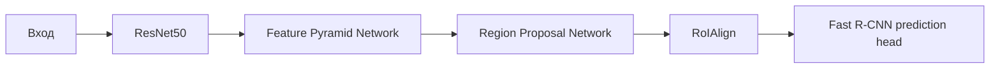
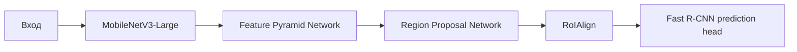
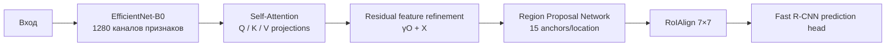
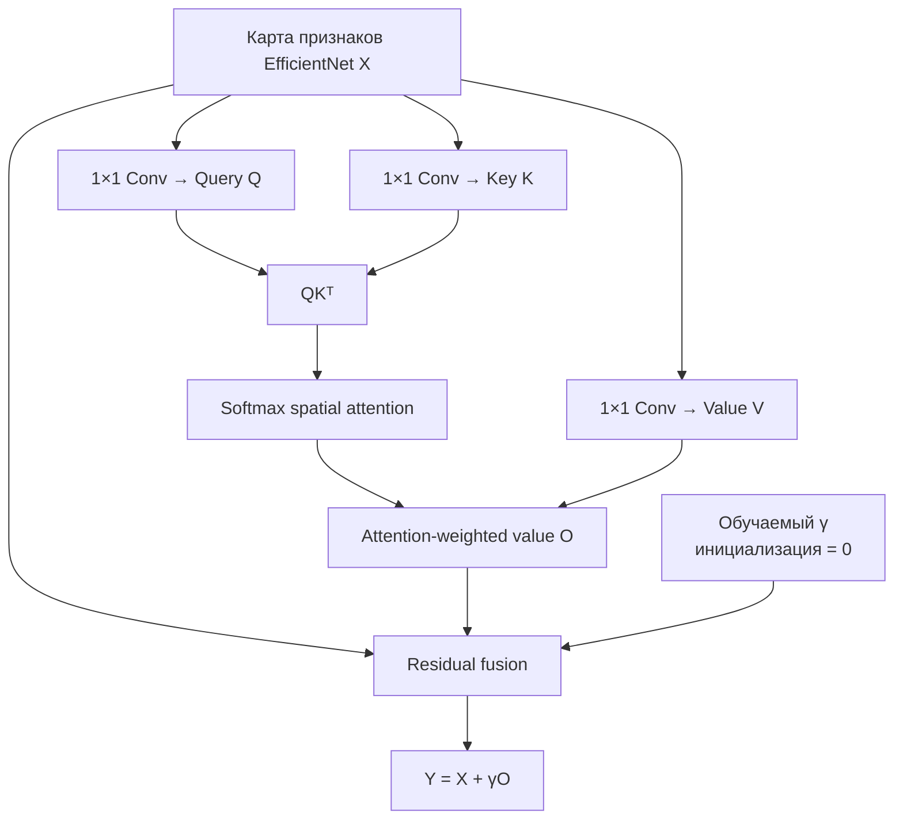
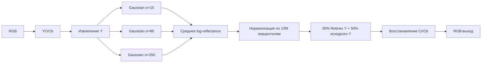
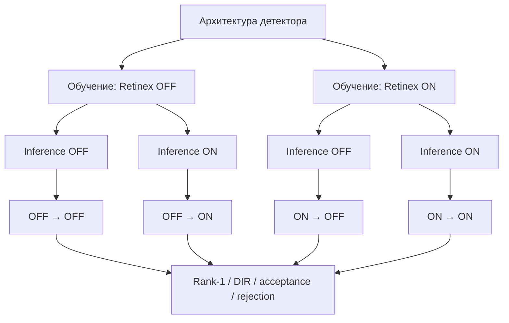

# Детекция и идентификация лиц с EfficientNet-B0, Self-Attention, MSR-Y Retinex и FaceNet

  
  
  
  
  

## Обзор

В данном репозитории представлен полный экспериментальный ML-pipeline для **детекции и идентификации лиц**. В исследовании сравниваются три конфигурации детектора Faster R-CNN в контролируемых условиях предварительной обработки:

- **ResNet50-FPN Faster R-CNN**
- **MobileNetV3-Large-FPN Faster R-CNN**
- **EfficientNet-B0 + Self-Attention Faster R-CNN**

Каждый детектор обучается и оценивается в двух согласованных режимах предварительной обработки:

- **Retinex OFF**
- **MSR-Y Retinex ON**

Идентификация личности выполняется на отдельном embedding-уровне с использованием замороженной модели **FaceNet / InceptionResnetV1, предварительно обученной на VGGFace2**. Обнаруженные области лица преобразуются в **512-мерные L2-нормированные эмбеддинги**, после чего сопоставляются с эталонными центроидами, сформированными только по обучающей выборке.

Таким образом, в блокноте оценивается не только точность детектора, но также:

- влияние Retinex на каждую архитектуру;
- согласованность предварительной обработки между обучением и inference;
- последующая идентификация по embedding-представлениям;
- устойчивость к контролируемым изменениям освещения;
- задержка детектора и полного pipeline;
- использование GPU-памяти;
- воспроизводимость за счёт детерминированной инициализации и checkpoint-механизма.

Полный эксперимент реализован в:

> **`face_identity_full.ipynb`**

---

## Содержание

1. [Цель исследования](#цель-исследования)
2. [Конфигурация набора данных](#конфигурация-набора-данных)
3. [Архитектура системы](#архитектура-системы)
4. [Архитектуры детекторов](#архитектуры-детекторов)
5. [Модуль Self-Attention](#модуль-self-attention)
6. [Предварительная обработка MSR-Y Retinex](#предварительная-обработка-msr-y-retinex)
7. [Идентификация с FaceNet](#идентификация-с-facenet)
8. [Экспериментальный протокол](#экспериментальный-протокол)
9. [Основные результаты](#основные-результаты)
10. [Ablation-анализ Retinex](#ablation-анализ-retinex)
11. [Результаты идентификации](#результаты-идентификации)
12. [Устойчивость к изменению освещения](#устойчивость-к-изменению-освещения)
13. [Вычислительная производительность](#вычислительная-производительность)
14. [Воспроизводимость](#воспроизводимость)
15. [Состав Jupyter Notebook](#состав-jupyter-notebook)
16. [Методологическая интерпретация](#методологическая-интерпретация)
17. [Ограничения](#ограничения)
18. [Литература](#литература)

---

# Цель исследования

Цель работы — оценить, способна ли архитектура на основе **EfficientNet-B0, усиленная пространственным модулем Self-Attention**, обеспечить более сильный профиль точности и устойчивости по сравнению с базовыми конфигурациями ResNet50-FPN и MobileNetV3-FPN, а также определить влияние **MSR-Y Retinex-нормализации освещения** на все три архитектуры.

Предлагаемый экспериментальный pipeline:

**нормализация освещения → детекция лица → извлечение области лица → FaceNet embedding → сопоставление с эталоном → пороговое решение об идентичности**

Методологический вклад заключается не в разработке EfficientNet, Faster R-CNN, Retinex или FaceNet по отдельности, а в контролируемой реализации и оценке их интеграции с особым акцентом на:

1. **EfficientNet-B0 + Self-Attention в качестве признаковой основы Faster R-CNN**;
2. **контролируемый ablation-анализ Retinex OFF/ON** для каждого детектора;
3. **полный анализ согласованности Retinex 2×2 между обучением и inference**;
4. **независимую идентификацию по embedding-представлениям** с использованием FaceNet;
5. **анализ задержки, памяти и устойчивости к освещению** в рамках единого экспериментального pipeline.

---

# Конфигурация набора данных

Для экспериментальной конфигурации репозитория используется сформированная подвыборка **VGGFace2**, организованная в обучающую, валидационную и тестовую части.

| Раздел | Изображения лиц | Записи / профили | Доля |
|---|---:|---:|---:|
| Train | 3 039 | 3 039 | 33,7% |
| Validation | 2 941 | 2 941 | 32,6% |
| Test | 3 036 | 3 036 | 33,7% |
| **Всего** | **9 016** | **9 016** | **100%** |

Разделы используются для различных экспериментальных задач:

- **Train** — оптимизация параметров моделей и формирование эталонных embedding-представлений;
- **Validation** — промежуточная оценка и калибровка порога расстояния при идентификации;
- **Test** — итоговая оценка после фиксации модели и правил принятия решения.

> **Примечание по воспроизводимости.** Разбиение данных, приведённое выше, соответствует проектной спецификации репозитория. Численные таблицы результатов в данном README воспроизводят значения, сохранённые непосредственно в выполненном `face_identity_full.ipynb`.

---

# Архитектура системы

```mermaid
flowchart LR
    A["Входное RGB-изображение"] --> B{"MSR-Y Retinex"}
    B -->|OFF| C["Исходное RGB"]
    B -->|ON| D["RGB после нормализации освещения"]

    C --> E["Детектор лица"]
    D --> E

    E --> F["Предсказанный bounding box лица"]
    F --> G["Crop лица + resize до 160×160"]
    G --> H["FaceNet / InceptionResnetV1<br/>VGGFace2 pretrained"]
    H --> I["512D L2-нормированный embedding"]
    I --> J["Train-only centroid gallery"]
    J --> K["Расстояние между embeddings"]
    K --> L["Ближайший эталонный prototype"]
    L --> M["Порог, откалиброванный на validation"]
    M --> N["Итоговое решение об идентичности"]
```

Pipeline намеренно разделён на два функциональных уровня.

### Этап детекции
Faster R-CNN локализует область лица.

### Этап идентификации
Замороженная модель FaceNet преобразует обнаруженную область в 512-мерный признаковый вектор и выполняется сопоставление с ближайшим эталонным prototype.

FaceNet **не оптимизируется совместно с детектором**, а его embedding loss не добавляется в objective Faster R-CNN.

---

# Архитектуры детекторов

## 1. ResNet50-FPN Faster R-CNN

Конфигурация ResNet50 следует стандартной двухэтапной схеме Faster R-CNN с многомасштабным представлением признаков через FPN.

**Зафиксированное количество параметров:** 41,31 млн.

---

## 2. MobileNetV3-Large-FPN Faster R-CNN

MobileNetV3-Large-FPN используется как вычислительно облегчённая базовая архитектура.

**Зафиксированное количество параметров:** 18,94 млн.

Эта модель обеспечивает минимальную задержку inference и наименьшее использование GPU-памяти среди исследованных архитектур.

---

## 3. EfficientNet-B0 + Self-Attention Faster R-CNN

Основная модифицированная архитектура использует:

- **EfficientNet-B0** в качестве feature extractor;
- выходное представление размерностью **1280 каналов**;
- собственный пространственный блок **Self-Attention**;
- RPN и RoI-обработку Faster R-CNN;
- размеры anchors `32, 64, 128, 256, 512`;
- aspect ratios `0.5, 1.0, 2.0`;
- **15 anchors на одну пространственную позицию**;
- выход RoIAlign размером `7×7`;
- sampling ratio `2`.

**Зафиксированное количество параметров:** 87,47 млн.

---

# Модуль Self-Attention

Модуль внимания получает тензор признаков EfficientNet:

$$
X \in \mathbb{R}^{B \times C \times H \times W}.
$$

Формируются три обучаемые проекции:

$$
Q = W_qX,\qquad
K = W_kX,\qquad
V = W_vX.
$$

Пространственная матрица внимания:

$$
A = \operatorname{softmax}(QK^T),
$$

а уточнённое представление объединяется с исходными признаками через residual-схему:

$$
Y = X + \gamma O.
$$

Здесь $\gamma$ — обучаемый скалярный параметр, инициализированный нулём.

Эта конструкция важна тем, что в начале обучения attention-модуль ведёт себя приблизительно как тождественное отображение. В ходе оптимизации сеть может постепенно увеличивать вклад глобальных пространственных зависимостей без резкого изменения исходного признакового представления EfficientNet на начальном этапе.

---

# Предварительная обработка MSR-Y Retinex

В проекте используется фиксированный алгоритм **Multi-Scale Retinex по яркостному каналу (MSR-Y)**.

Он:

- не является MSRCR;
- не является обучаемой нейросетевой Retinex-моделью;
- не активируется условно по порогу яркости изображения.

RGB-изображение преобразуется в **YCrCb**, после чего Retinex применяется только к яркостному каналу $Y$. Цветовые каналы $Cr$ и $Cb$ сохраняются.

Многомасштабная оценка reflectance задаётся выражением:

$$
R(x,y)
=
\frac{1}{3}
\sum_{k=1}^{3}
\left[
\log(Y(x,y)+1)
-
\log(G_{\sigma_k} * (Y(x,y)+1))
\right].
$$

### Конфигурация Retinex

| Параметр | Конфигурация |
|---|---|
| Метод | MSR-Y |
| Цветовое пространство | RGB → YCrCb |
| Обрабатываемый компонент | Y luminance |
| Максимальная сторона карты освещения | 256 px |
| Gaussian scales | 15, 80, 250 |
| Веса масштабов | 1/3 для каждого |
| Нормализация | 1-й / 99-й перцентили |
| Смешивание яркости | 50% исходного Y + 50% Retinex Y |
| Каналы Cr/Cb | сохраняются |
| Порог активации по яркости | отсутствует |

Роль Retinex определяется экспериментально, а не предполагается заранее как безусловно положительная.

---

# Идентификация с FaceNet

Для идентификации используется:

**`InceptionResnetV1(pretrained="vggface2")`**

Модель работает в замороженном режиме.

Для каждого обнаруженного лица:

1. извлекается область лица;
2. выполняется resize до **160×160**;
3. применяется входная нормализация;
4. FaceNet формирует **512D embedding**;
5. embedding L2-нормируется.

Для эталонных изображений одной идентичности train-эмбеддинги усредняются, а затем полученный centroid снова нормализуется:

$$
g_i =
\frac{
\frac{1}{N_i}\sum_{j=1}^{N_i}e_{ij}
}{
\left\|
\frac{1}{N_i}\sum_{j=1}^{N_i}e_{ij}
\right\|_2
}.
$$

Query embedding $q$ сравнивается с эталонным centroid $g_i$ по расстоянию:

$$
d(q,g_i)
=
\sqrt{\max(2 - 2g_i^Tq, 0)}.
$$

Для L2-нормированных embeddings это расстояние является монотонным преобразованием cosine similarity.

Формируются две независимые gallery:

- gallery для **Retinex OFF**;
- gallery для **Retinex ON**.

Это обеспечивает согласованность домена предварительной обработки между query и эталонными embeddings.

---

# Экспериментальный протокол

## Параметры обучения

| Параметр | Значение |
|---|---:|
| Epochs | 15 |
| Batch size | 2 |
| Optimizer | SGD |
| Learning rate | 0.005 |
| Momentum | 0.9 |
| Weight decay | 0.0005 |
| Precision | FP32 |
| Random seed | 20260915 |
| Scheduler | отсутствует |
| Early stopping | отсутствует |
| Gradient accumulation | отсутствует |

Каждая архитектура обучается дважды:

1. **без Retinex**;
2. **с Retinex**.

В результате выполняются **шесть полных запусков обучения детектора**.

Внутри каждой архитектурной пары модели OFF и ON создаются с одинаковым random seed, а блокнот явно проверяет совпадение SHA-256 хешей начального состояния параметров.

---

## Ablation-анализ Retinex между обучением и inference

После обучения идентификация оценивается в полном 2×2 дизайне предварительной обработки:

| Обучение | Inference |
|---|---|
| OFF | OFF |
| OFF | ON |
| ON | OFF |
| ON | ON |

Порог расстояния калибруется **только по validation-запросам**. Test-данные не используются для подбора порога.

---

# Основные результаты

## Качество детекции на тестовой выборке

Лучшие значения по каждой метрике выделены **жирным шрифтом**.

| Модель | Retinex | AP ↑ | AP75 ↑ | Precision ↑ | Recall ↑ | F1 ↑ |
|---|:---:|---:|---:|---:|---:|---:|
| ResNet50-FPN | OFF | **0.861** | 0.978 | 0.578 | **1.000** | 0.732 |
| ResNet50-FPN | ON | 0.830 | 0.929 | 0.627 | **1.000** | 0.771 |
| MobileNetV3-FPN | OFF | 0.823 | 0.984 | 0.687 | **1.000** | 0.814 |
| MobileNetV3-FPN | ON | 0.791 | 0.901 | 0.780 | **1.000** | 0.877 |
| EfficientNet-B0 + Self-Attention | OFF | 0.822 | 0.959 | 0.884 | **1.000** | 0.938 |
| EfficientNet-B0 + Self-Attention | ON | 0.843 | **1.000** | **0.899** | **1.000** | **0.947** |

### Интерпретация

Результаты показывают два взаимодополняющих вывода:

- **ResNet50-FPN без Retinex** демонстрирует максимальное значение AP: **0.861**.
- **EfficientNet-B0 + Self-Attention с Retinex** показывает лучшие:
  - **AP75 = 1.000**
  - **Precision = 0.899**
  - **F1 = 0.947**

Следовательно, EfficientNet-B0 + Self-Attention + Retinex обеспечивает наиболее сильное **сбалансированное качество детекции**, тогда как ResNet50 сохраняет абсолютный максимум AP.

---

# Ablation-анализ Retinex

Наиболее корректное сравнение Retinex выполняется **внутри одной и той же архитектуры**, поскольку detector heads у всех трёх моделей не полностью идентичны.

| Архитектура | AP OFF | AP ON | ΔAP | F1 OFF | F1 ON | ΔF1 |
|---|---:|---:|---:|---:|---:|---:|
| ResNet50-FPN | **0.861** | 0.830 | −0.031 | 0.732 | 0.771 | +0.039 |
| MobileNetV3-FPN | 0.823 | 0.791 | −0.032 | 0.814 | 0.877 | **+0.062** |
| EfficientNet-B0 + Self-Attention | 0.822 | **0.843** | **+0.021** | **0.938** | **0.947** | +0.008 |

Ключевой результат состоит в том, что **EfficientNet-B0 + Self-Attention является единственной исследованной архитектурой, у которой AP увеличивается после включения Retinex**:

$$
0.822 \rightarrow 0.843
$$

что соответствует:

$$
\Delta AP = \mathbf{+0.021}.
$$

Для сравнения:

- ResNet50: $\Delta AP=-0.031$
- MobileNetV3: $\Delta AP=-0.032$

Таким образом, Retinex демонстрирует **архитектурно-зависимый эффект**, а не универсальное улучшение.

---

# Результаты идентификации

Оценка идентификации включает успешность детектора, локализацию, сопоставление FaceNet embeddings и откалиброванный порог расстояния.

## Согласованные режимы предварительной обработки

Лучшие значения выделены **жирным шрифтом**. Одинаковые максимумы отмечены совместно.

| Модель | Rank-1 OFF→OFF ↑ | DIR OFF→OFF ↑ | Rank-1 ON→ON ↑ | DIR ON→ON ↑ |
|---|---:|---:|---:|---:|
| ResNet50-FPN | **1.000** | **1.000** | **1.000** | **1.000** |
| MobileNetV3-FPN | **1.000** | 0.994 | 0.981 | 0.981 |
| EfficientNet-B0 + Self-Attention | **1.000** | **1.000** | **1.000** | **1.000** |

EfficientNet-B0 + Self-Attention сохраняет максимальные значения Rank-1 и DIR в обоих согласованных режимах предварительной обработки.

---

## Полная оценка 2×2 для EfficientNet-B0 + Self-Attention

| Обучение → Inference | Rank-1 ↑ | DIR ↑ | Wrong acceptance ↓ | Rejection ↓ |
|---|---:|---:|---:|---:|
| OFF → OFF | **1.000** | **1.000** | **0.000** | **0.000** |
| OFF → ON | **1.000** | **1.000** | **0.000** | **0.000** |
| ON → OFF | **1.000** | **1.000** | **0.000** | **0.000** |
| ON → ON | **1.000** | **1.000** | **0.000** | **0.000** |

В рамках выполненного экспериментального протокола детектор EfficientNet-B0 + Self-Attention не показывает деградации идентификации ни в одной из четырёх комбинаций Retinex между обучением и inference.

---

# Устойчивость к изменению освещения

В notebook оценивается устойчивость идентификации при четырёх условиях:

1. исходное изображение;
2. яркость, умноженная на 0.5;
3. gamma-преобразование с $\gamma=1.6$;
4. синтетическая односторонняя тень.

Эталонная gallery и порог идентификации остаются фиксированными.

| Модель | Retinex | Original DIR ↑ | Brightness ×0.5 ↑ | Gamma 1.6 ↑ | Side shadow ↑ |
|---|:---:|---:|---:|---:|---:|
| ResNet50-FPN | OFF | **1.000** | **1.000** | **1.000** | **1.000** |
| ResNet50-FPN | ON | **1.000** | **1.000** | **1.000** | **1.000** |
| MobileNetV3-FPN | OFF | 0.994 | 0.994 | 0.994 | **1.000** |
| MobileNetV3-FPN | ON | 0.981 | **1.000** | **1.000** | **1.000** |
| EfficientNet-B0 + Self-Attention | OFF | **1.000** | **1.000** | **1.000** | **1.000** |
| EfficientNet-B0 + Self-Attention | ON | **1.000** | **1.000** | **1.000** | **1.000** |

EfficientNet-B0 + Self-Attention сохраняет **DIR = 1.000** во всех исследованных условиях освещения как без Retinex, так и с его использованием.

---

# Вычислительная производительность

## Эффективность на уровне детектора

Для задержки, памяти и времени обучения меньшее значение является лучшим.

| Модель | Retinex | Median detector latency ↓ | Median Read + Detect ↓ | Peak CUDA memory ↓ | Время обучения ↓ |
|---|:---:|---:|---:|---:|---:|
| ResNet50-FPN | OFF | 49.48 ms | 52.15 ms | 683.60 MiB | 19.92 min |
| ResNet50-FPN | ON | 52.34 ms | 81.03 ms | 689.26 MiB | 22.47 min |
| MobileNetV3-FPN | OFF | **13.05 ms** | **15.27 ms** | **386.93 MiB** | **5.02 min** |
| MobileNetV3-FPN | ON | 14.00 ms | 40.97 ms | **386.93 MiB** | 8.30 min |
| EfficientNet-B0 + Self-Attention | OFF | 28.46 ms | 30.91 ms | 727.12 MiB | 16.67 min |
| EfficientNet-B0 + Self-Attention | ON | 31.85 ms | 60.74 ms | 727.12 MiB | 19.59 min |

MobileNetV3 является явным лидером по вычислительной эффективности.

EfficientNet-B0 + Self-Attention, напротив, представляет **ориентированную на качество рабочую точку**: существенно более высокие Precision/F1 по сравнению с базовыми моделями при умеренной задержке inference.

---

## Задержка полного pipeline идентификации

Этот benchmark включает:

**чтение изображения → опциональный Retinex → детектор → crop лица → FaceNet → сопоставление с gallery**

| Модель | Retinex | Median identity latency ↓ | P95 latency ↓ | Throughput ↑ |
|---|:---:|---:|---:|---:|
| ResNet50-FPN | OFF | 64.48 ms | 76.23 ms | 15.12 FPS |
| ResNet50-FPN | ON | 90.84 ms | 99.30 ms | 10.83 FPS |
| MobileNetV3-FPN | OFF | **27.49 ms** | **30.55 ms** | **35.90 FPS** |
| MobileNetV3-FPN | ON | 53.34 ms | 62.78 ms | 18.36 FPS |
| EfficientNet-B0 + Self-Attention | OFF | 42.79 ms | 50.85 ms | 22.76 FPS |
| EfficientNet-B0 + Self-Attention | ON | 74.99 ms | 90.61 ms | 13.08 FPS |

Результаты также количественно показывают вычислительную стоимость Retinex: предварительная обработка добавляет заметную задержку на CPU.

---

# Воспроизводимость

Notebook содержит явные механизмы обеспечения воспроизводимости.

## Фиксированная экспериментальная конфигурация

- seed: `20260915`
- обучение и inference в FP32;
- фиксированные гиперпараметры SGD;
- фиксированное количество эпох;
- без scheduler;
- без early stopping;
- без gradient accumulation.

## Согласованная инициализация

Для каждой архитектуры Retinex OFF и ON запуски создаются из одинакового random seed.

Notebook вычисляет и проверяет **SHA-256 хеш начального состояния модели**, обеспечивая эквивалентную инициализацию в парных сравнениях.

## Содержимое checkpoint

Каждый checkpoint сохраняет:

- состояние модели;
- состояние optimizer;
- номер эпохи;
- историю обучения;
- Python RNG state;
- NumPy RNG state;
- PyTorch RNG state;
- CUDA RNG state.

## Референсная среда выполнения

В выполненном notebook зафиксировано:

- **PyTorch:** `2.7.1+cu128`
- **CUDA:** включена
- **Референсный GPU:** NVIDIA GeForce RTX 5070 Laptop GPU
- **Precision:** FP32

Notebook явно требует CUDA и не выполняет скрытый fallback на CPU.

---

# Состав Jupyter Notebook

`face_identity_full.ipynb` содержит:

- **35 ячеек всего**
- **23 code cells**
- **12 Markdown cells**

Выполненный workflow включает:

1. конфигурацию среды;
2. подготовку данных;
3. реализацию Retinex;
4. построение Dataset и DataLoader;
5. определение архитектур детекторов;
6. интеграцию EfficientNet-B0 + Self-Attention;
7. извлечение FaceNet embeddings;
8. построение train-only gallery;
9. CUDA-проверку архитектур;
10. обучение детекторов;
11. checkpointing и поддержку resume;
12. validation logging;
13. test prediction;
14. COCO-style AP evaluation;
15. benchmark задержки;
16. измерение GPU-памяти;
17. сравнение Retinex OFF/ON;
18. анализ 2×2 train/inference preprocessing;
19. калибровку порога только по validation;
20. оценку Rank-1 и DIR;
21. synthetic lighting stress-test;
22. итоговые научные таблицы и графики;
23. финальные completion metadata.

Завершённый notebook содержит:

- **6 запусков обучения детекторов**
- **12 комбинаций идентификации train/inference**
- **24 комбинации результатов при изменении освещения**

---

# Методологическая интерпретация

## Почему EfficientNet-B0 + Self-Attention является основной конфигурацией

Выбранная архитектура демонстрирует наиболее сильный совокупный профиль качества.

Без Retinex она уже достигает:

- Precision = `0.884`
- F1 = `0.938`

С Retinex:

- **Precision = 0.899**
- **F1 = 0.947**
- **AP75 = 1.000**
- AP = `0.843`

Это показывает, что её результат не объясняется только нормализацией освещения.

---

## Почему результат Retinex имеет значение

Retinex не улучшает все модели одинаковым образом.

Только EfficientNet-B0 + Self-Attention показывает положительное изменение AP:

$$
\mathbf{\Delta AP=+0.021}.
$$

Полученный результат поддерживает архитектурно-зависимую интерпретацию:

> нормализация освещения может быть полезной в тех случаях, когда сформированное представление эффективно взаимодействует с последующим feature extractor и механизмом пространственного внимания.

Такой вывод является более обоснованным, чем утверждение о том, что Retinex универсально улучшает детекцию лиц.

---

## Точность и вычислительная стоимость

Ни одна архитектура не превосходит остальные по всем критериям одновременно:

- **ResNet50-FPN OFF** — максимальный AP;
- **MobileNetV3-FPN OFF** — минимальная задержка и наименьшее потребление памяти;
- **EfficientNet-B0 + Self-Attention + Retinex** — лучшие Precision, F1 и AP75.

Поэтому система анализируется как **компромисс между точностью, устойчивостью и вычислительной эффективностью**, а не выбирается на основе одной метрики.

---

# Ограничения

Notebook поддерживает осторожную интерпретацию полученных результатов.

- Эксперименты выполнены с одним фиксированным random seed.
- Часть процесса локализационной разметки лиц формируется автоматически.
- Синтетические изменения освещения не эквивалентны независимым реальным съёмочным сессиям.
- Порог идентификации, откалиброванный по validation, не следует интерпретировать как гарантированный production open-set FAR.
- FaceNet используется с готовыми весами VGGFace2 и не дообучается в данном эксперименте.
- Detector-head objectives не полностью идентичны между всеми архитектурами; поэтому межмодельные различия нельзя полностью приписывать только backbone или Self-Attention.
- Наиболее чистое контролируемое сравнение Retinex — это **OFF vs ON внутри одной и той же архитектуры**.
- Идеальные или почти идеальные показатели идентификации в выполненном протоколе следует интерпретировать как результат в исследованных экспериментальных условиях, а не как универсальную гарантию точности реальной системы распознавания лиц.

---

# Ключевые результаты

| Результат | Значение |
|---|---:|
| Максимальный AP | **0.861 — ResNet50-FPN, Retinex OFF** |
| Максимальный AP75 | **1.000 — EfficientNet-B0 + Self-Attention, Retinex ON** |
| Максимальный Precision | **0.899 — EfficientNet-B0 + Self-Attention, Retinex ON** |
| Максимальный F1 | **0.947 — EfficientNet-B0 + Self-Attention, Retinex ON** |
| Положительное изменение AP от Retinex | **+0.021 — EfficientNet-B0 + Self-Attention** |
| Лучший matched Rank-1 | **1.000** |
| Лучший matched DIR | **1.000** |
| Самый быстрый детектор | **13.05 ms — MobileNetV3-FPN, Retinex OFF** |
| Самый быстрый полный identity pipeline | **27.49 ms — MobileNetV3-FPN, Retinex OFF** |
| Минимальное peak CUDA memory | **386.93 MiB — MobileNetV3-FPN** |

---

# Заключение

В проекте реализован полный и воспроизводимый экспериментальный framework для **детекции лиц и идентификации на основе embeddings**.

Основная ориентированная на качество конфигурация:

> **MSR-Y Retinex → EfficientNet-B0 → Self-Attention → Faster R-CNN → FaceNet/VGGFace2 512D embedding → centroid matching**

Выполненные эксперименты показывают, что **EfficientNet-B0 + Self-Attention с Retinex** обеспечивает наиболее сильный сбалансированный профиль детекции среди исследованных конфигураций:

- **Precision = 0.899**
- **F1 = 0.947**
- **AP75 = 1.000**
- AP = `0.843`
- **ΔAP = +0.021** после включения Retinex
- **Rank-1 = 1.000**
- **DIR = 1.000**

Одновременно результаты показывают, что Retinex не является универсально полезным: его эффект зависит от архитектуры, а использование Retinex приводит к измеримому увеличению вычислительных затрат.

Таким образом, notebook поддерживает научно обоснованный вывод: наиболее сильный результат возникает за счёт **совместного взаимодействия EfficientNet-B0 как feature extractor, пространственного Self-Attention, контролируемой MSR-Y нормализации освещения и независимого embedding-уровня FaceNet**, а не благодаря одному отдельному компоненту.

---

# Литература

1. Schroff, F., Kalenichenko, D., & Philbin, J. **FaceNet: A Unified Embedding for Face Recognition and Clustering.** CVPR, 2015.  
   https://arxiv.org/abs/1503.03832

2. Cao, Q., Shen, L., Xie, W., Parkhi, O. M., & Zisserman, A. **VGGFace2: A Dataset for Recognising Faces across Pose and Age.** FG, 2018.  
   https://arxiv.org/abs/1710.08092

3. Tan, M., & Le, Q. V. **EfficientNet: Rethinking Model Scaling for Convolutional Neural Networks.** ICML, 2019.  
   https://arxiv.org/abs/1905.11946

4. Ren, S., He, K., Girshick, R., & Sun, J. **Faster R-CNN: Towards Real-Time Object Detection with Region Proposal Networks.** NeurIPS, 2015.  
   https://arxiv.org/abs/1506.01497

5. Jobson, D. J., Rahman, Z., & Woodell, G. A. **A Multiscale Retinex for Bridging the Gap Between Color Images and the Human Observation of Scenes.** IEEE Transactions on Image Processing, 1997.

---

## Основной артефакт

**Jupyter Notebook:** `face_identity_full.ipynb`

Notebook содержит полный ML-код, логику обучения, эксперименты Retinex, оценку идентификации с FaceNet, научные таблицы, графики, измерения задержки и итоговые экспериментальные результаты, описанные выше.
